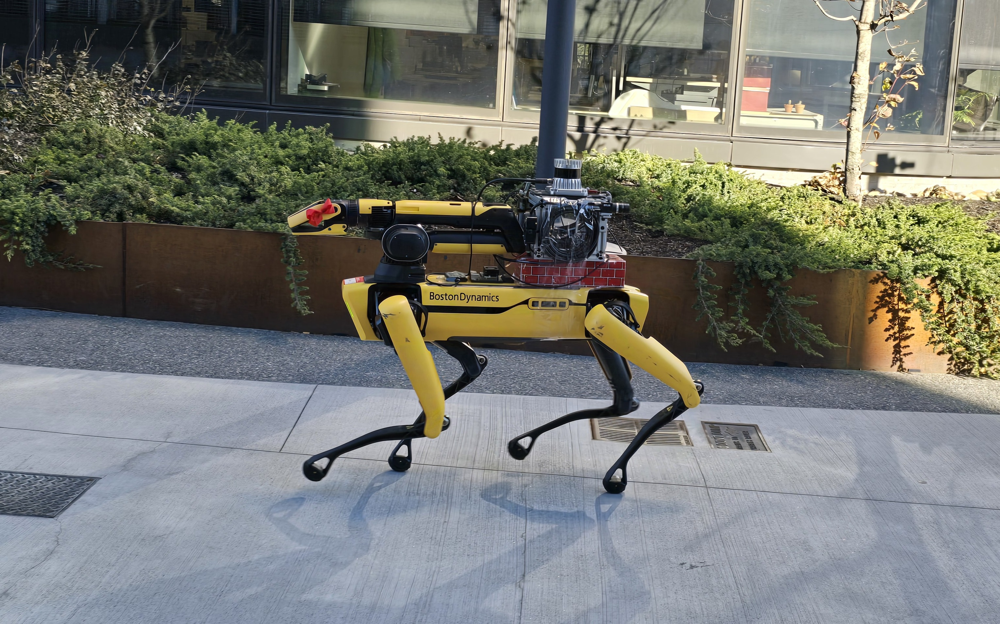

# 👋 Hi, I'm Yash Sanjay Wakde! 🚀

🎓 **Master's Student in Robotics** at **Northeastern University**, Boston  
📍 A relentless innovator dedicated to pushing the boundaries of robotics, striving to create intelligent automation that transforms industries and reshapes the future.  
📧 **Email:** wakde.y@northeastern.edu | 📱 **Phone:** +1 857-398-7984 | 🌐 [LinkedIn](https://linkedin.com/in/yash-wakde444/)

---

## 🌟 About Me

- 🔍 Passionate about developing cutting-edge solutions in **autonomous navigation** and **control systems**.  
- 🛠️ Versatile with expertise in **ROS**, **Python**, **Fusion 360**, and embedded platforms like Arduino and Raspberry Pi.  
- 📜 Holder of **4 Design Patents**, reflecting a strong track record of innovative problem-solving.  
- 💡 Experienced in implementing **LiDAR-Inertial SLAM** and crafting advanced **path planning algorithms** for real-world applications.  

---

## 🛠️ Key Skills

- **Programming Languages:** Python, MATLAB, C  
- **Tools & Platforms:** ROS, Fusion 360, Multisim, PSpice, SIMATIC S7-PLCSIM  
- **Hardware Expertise:** Arduino, ESP32, Raspberry Pi, Siemens PLCs  
- **Specialized Algorithms:** SLAM, RRT*, Sensor Fusion  

---

## 📂 Highlighted Projects

### 1️⃣ **LiDAR-Inertial SLAM on Boston Dynamics Spot**
- 🦾 Successfully implemented **LIO-SAM** for high-precision **SLAM** leveraging **LiDAR** and **IMU** data.  
- 🌍 Ensured robust navigation in dynamic environments with validated mapping accuracy.  
- 📊 Presented results, offering insights to optimize future SLAM developments.  

### 2️⃣ **Advanced Path Planning: BRRT***
- 🚀 Engineered a bi-directional variant of **RRT***, achieving faster convergence and superior path quality.  
- 📈 Benchmarked against RRT, RRT*, and BRRT, demonstrating exceptional performance in obstacle-laden environments.  

	

### 3️⃣ **GPS & IMU Sensor Fusion**
- 🌐 Fused **GPS** and **IMU** data for automotive dead reckoning in **ROS2**, enhancing accuracy and reliability.  
- 📊 Addressed sensor noise and bias through advanced calibration techniques.  

### 4️⃣ **AI-Based Sapling Growth Monitoring System**
- 🌱 Designed an innovative AI-powered system with a patented auto-leveling tripod for stable image capture.  
- 📷 Utilized **computer vision** to monitor growth patterns and improve agricultural practices.  

---

## 🏆 Achievements

- **4 Design Patents** in groundbreaking engineering solutions:  
  - 🎯 **Auto-Leveling Tripod** for AI-based Sapling Growth Monitoring System  
  - 🎯 **Smart Pill Bottle**  
  - 🎯 **Automatic Oil Dispenser**  
  - 🎯 **Duo Duster**  

---

## 🌐 Let's Connect!

- 📝 **LinkedIn:** [linkedin.com/in/yash-wakde444/](https://linkedin.com/in/yash-wakde444/)  
- 📫 **Email:** wakde.y@northeastern.edu  
- 🌟 **Always open to collaboration, learning, and exploring opportunities to innovate!**  

---

⚡ *Let’s build the future of robotics together!* ⚡
