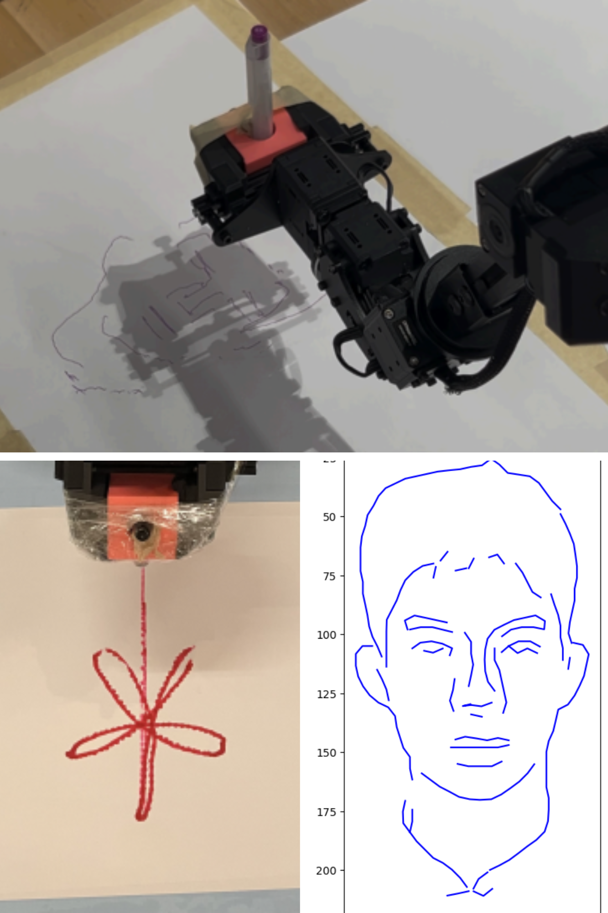
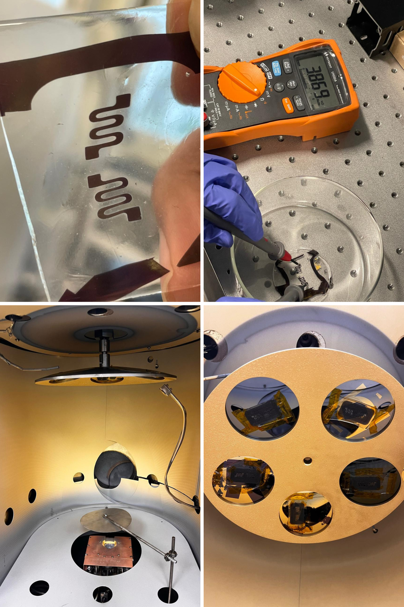
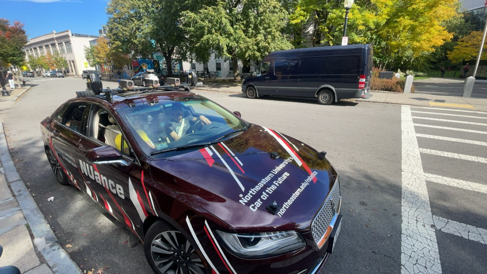

# 👋 Hi, I'm Yash Sanjay Wakde! 🚀

🎓 **Master’s Student in Robotics** at **Northeastern University**, Boston  
📍 Passionate about building intelligent, autonomous systems that bridge perception and control in the real world.  
📧 **Email:** wakde.y@northeastern.edu | 📱 **Phone:** +1 857-398-7984 | 🌐 [LinkedIn](https://linkedin.com/in/yash-wakde444/) | [Portfolio](https://yashwakde.my.canva.site/)

---

## 🌟 About Me

- 🤖 Hands-on with autonomous navigation, control systems, robotic perception, and soft electronics.
- 🧠 Strong grasp of **SLAM**, **sensor fusion**, **trajectory planning**, and **pose estimation**.
- 📜 Holder of **4 Design Patents**, showcasing innovation in hardware and product design.
- 🧪 Experienced with integrating **vision**, **LiDAR**, and **IMU** for reliable real-world performance.

---

## 🛠️ Key Skills

- **Languages:** Python, MATLAB, C  
- **Tools & Platforms:** ROS, ROS2, Fusion 360, BlenderProc, Multisim, PSpice  
- **Hardware:** Arduino, ESP32, Raspberry Pi, Siemens PLCs, WidowX 250s  
- **Core Robotics:** SLAM, RRT*, BRRT*, Sensor Fusion, Inverse Kinematics  
- **Fabrication:** 3D Printing, Thermal Evaporation, Nanowire Deposition, Ecoflex-based Soft Substrates  

---

## 📂 Highlighted Projects

### 🔹 **1. LiDAR-Inertial SLAM on Boston Dynamics Spot**
- 🦾 Implemented **LIO-SAM** to enable robust SLAM using LiDAR and IMU data.  
- 🌍 Ensured consistent mapping and localization even in dynamic environments.  
- 📊 Delivered real-time pose estimation, suitable for long-term autonomy.  

	

---

### 🔹 **2. Autonomous Robotic Sketching System**
- ✍️ Developed a full robotic sketch pipeline using **Trossen WidowX 250s**.  
- 🖼️ Transformed portraits into clean drawable paths using edge detection and graph theory.  
- 🛠️ Addressed challenges like IK stability, waypoint optimization, and tool holding precision.  

	

---

### 🔹 **3. Stretchable Nanowire-Based Strain Sensor for Robotics**
- 🧪 Fabricated a **serpentine-structured strain sensor** with AgNWs and Ecoflex 0031.  
- 📏 Achieved a gauge factor ~26K and strain detection up to 23%.  
- ✔️ Application areas include **robotic e-skin**, **HMI**, **biomedical wearables**, and **soft robotics**.  
- 💡 Tackled fabrication challenges like gold adhesion, encapsulation, and uniform nanowire dispersion.  

	

---

### 🔹 **4. Deep Object Pose Estimation Using DOPE**
- 📦 Trained a fully convolutional pose estimator on **synthetic data** using BlenderProc.  
- 🎯 Achieved 6-DoF pose estimation in real-time via **PnP with RGB input only**.  
- 🧠 Designed multi-object pipelines with belief maps and affinity fields.  

	

---

### 🔹 **5. GPS & IMU Sensor Fusion in ROS2**
- 🌐 Implemented dead reckoning by fusing **GPS** and **IMU** data streams.  
- 🔧 Tuned for dynamic calibration, sensor noise filtering, and drift mitigation.  
- 📍 Used for trajectory tracking in automotive-scale robots.

	

---

### 🔹 **6. Advanced Path Planning: BRRT***
- 🚀 Developed a **bi-directional RRT*** variant for high-efficiency path planning.  
- 📈 Benchmarked against traditional RRT/RRT*, showing faster convergence and optimal path quality.  

	

---

### 🔹 **7. AI-Based Sapling Growth Monitoring System**
- 🌱 Designed a tripod-mounted vision system to monitor sapling growth with AI.  
- 📷 Featured an **auto-leveling mechanism** (patented) to ensure consistent image capture.  
- 🌾 Improved precision agriculture through vision-based growth tracking.  

	

---

## 🏆 Achievements & Patents

- **4 Design Patents** for practical engineering innovation:
  - 🎯 [**Auto-Leveling Tripod** for AI Sapling Monitoring](https://search.ipindia.gov.in/DesignQRStatus/PDF_Viewer.aspx?AppNo=NDE3MjYwLTAwMQ==&CNo=MTc0MTgw)
  - 🎯 [**Smart Pill Bottle**](https://search.ipindia.gov.in/DesignQRStatus/PDF_Viewer.aspx?AppNo=Mzg2MTUxLTAwMQ==&CNo=MTQxODc5)
  - 🎯 [**Automatic Oil Dispenser**](https://search.ipindia.gov.in/DesignQRStatus/PDF_Viewer.aspx?AppNo=NDIwNDI5LTAwMQ==&CNo=MTc3NjY4)
  - 🎯 [**Duo Duster**](https://search.ipindia.gov.in/DesignQRStatus/PDF_Viewer.aspx?AppNo=Mzg2Njc3LTAwMQ==&CNo=MTQxNjE0)

---

## 🌐 Let's Connect!

- 📝 **LinkedIn:** [linkedin.com/in/yash-wakde444/](https://linkedin.com/in/yash-wakde444/)  
- 📫 **Email:** wakde.y@northeastern.edu  
- 💬 Always open to internships, collaborations, and new ideas in robotics, AI, or automation.

---

⚡ *“Let’s build the future of robotics together!”* ⚡
